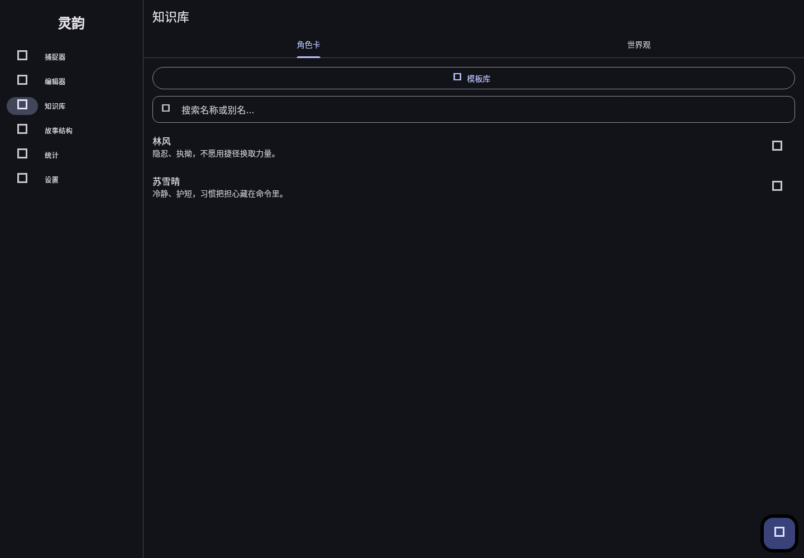
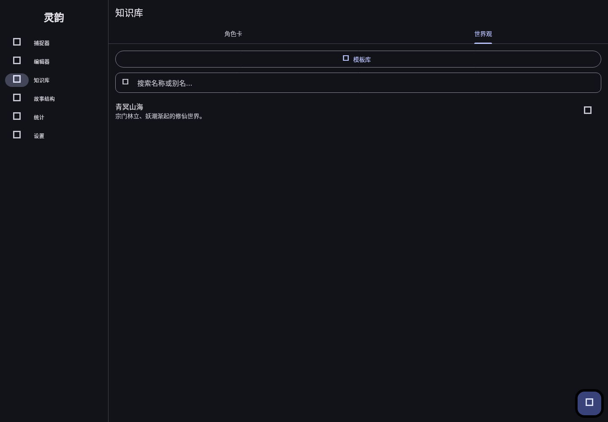
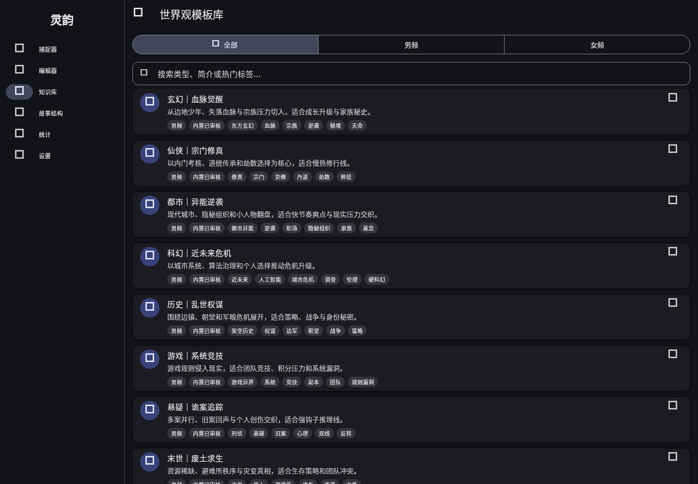
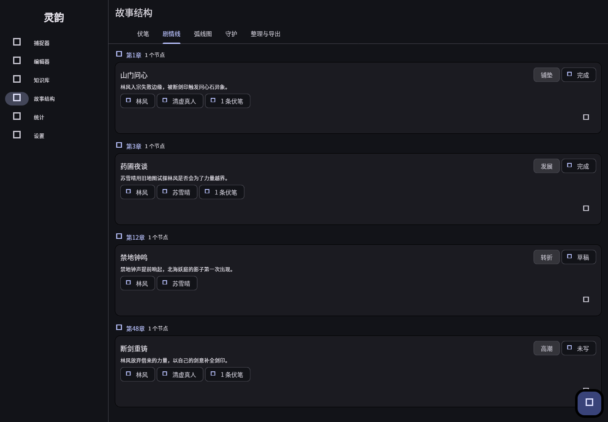
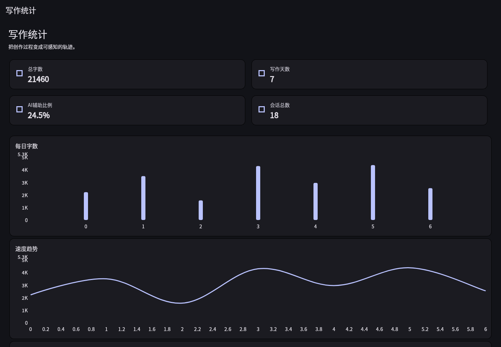
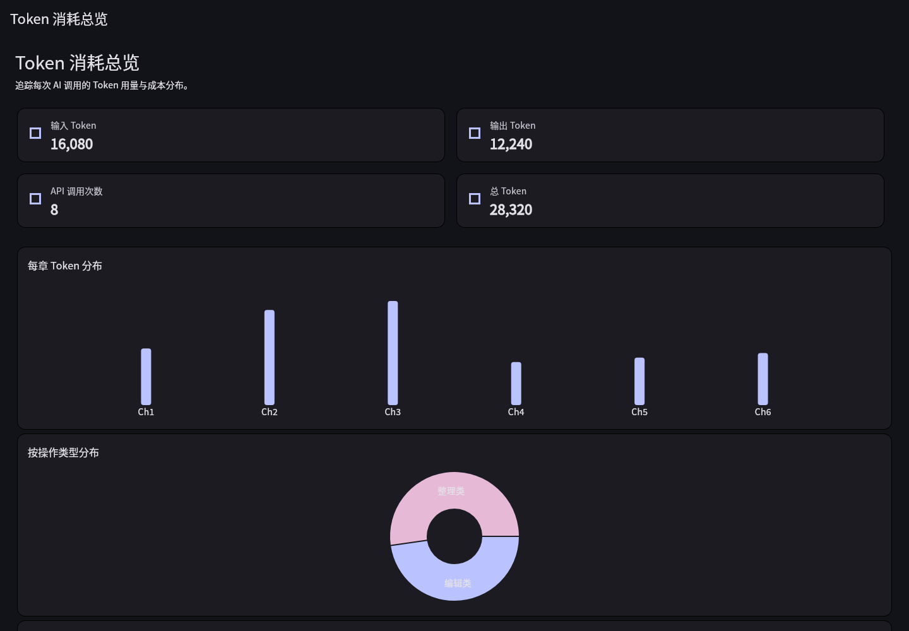
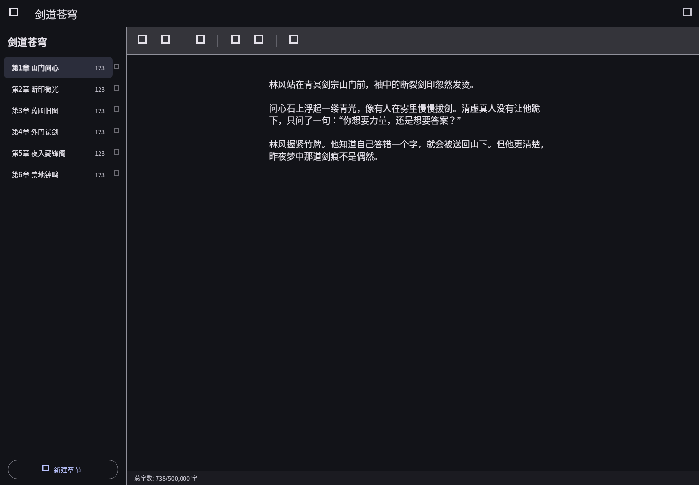

# MuseFlow

English | [中文](README.md)

> Imagination as the bones. AI as the wings.

MuseFlow is an AI-assisted writing workspace for long-form fiction authors. It is not a one-click novel generator, and it does not reduce writers to prompt operators. Its job is quieter and more useful: capture ideas, organize settings, protect foreshadowing, polish prose, and keep the author in control of the story.

## Why MuseFlow Exists

As fiction platforms become stricter about low-effort AI content, the real question is not whether writers should use AI. The question is who leads the story. MuseFlow is built around a clear answer: the author leads. AI listens to your material, helps structure what is already in your mind, and turns scattered fragments into workable drafts. Characters, world rules, promises, pacing, and judgment stay with the writer.

The Chinese name, 灵韵, means the spirit and rhythm of inspiration. MuseFlow combines Muse and Flow: a tool for entering a steadier creative state without surrendering authorship.

## Who It Is For

- **Writers with big stories and rough prose**: rich worlds and strong scenes, but difficulty with openings, transitions, and line-level expression.
- **Plot-first creators**: authors who want help managing characters, settings, clues, and structure instead of generic AI prose.
- **Serial fiction authors**: writers who need to remember every promise, hidden thread, and character boundary across dozens or hundreds of chapters.

## A Real User Journey

The screenshots below were captured from real Flutter UI states for this README. We step into the role of a xianxia serial author and move through idea capture, manuscript management, chapter writing, knowledge management, structure tracking, analytics, and model configuration.

### 1. Manage Multiple Works

The manuscript library supports parallel projects, progress tracking, genres, target word counts, and recent activity.


### 2. Capture Ideas Before They Disappear

The capture inbox stores scenes, lines, conflicts, and foreshadowing seeds. Tags make raw ideas searchable before they become chapters.


### 3. Give AI a Memory

Character cards preserve personality, appearance, aliases, and backstory, so AI-assisted writing knows who a character is and how they should behave.



World settings store rules, factions, geography, and technology or magic levels. For high-setting genres, this is the foundation for consistency.



### 4. Start Faster With Templates and Rules

The template gallery turns genre patterns into reusable world-building scaffolds. It helps authors move from a concept to a writable setting faster.



Skill documents define active writing rules: power hierarchy, faction relationships, banned tropes, terminology, and anti-AI-scent style constraints.


### 5. Protect Long-Form Structure

Foreshadowing management tracks where a clue was planted, whether it is developing, and when it should resolve.


The plot timeline organizes key beats by chapter, involved characters, writing state, and linked foreshadowing.



The story arc graph helps authors inspect setup, turns, climaxes, and resolutions visually.


The logic guardian highlights consistency risks, forgotten threads, and setting drift.


Cleanup and export prepare the manuscript for delivery with format checks and bundled output.


### 6. Measure the Writing Process

Writing stats show daily output, speed trends, AI-assist ratio, and session count. MuseFlow does not reward empty volume; it helps writers understand their rhythm.



Token auditing records input, output, model, and operation type for every AI call. Long-form projects need transparent cost control.



The reports hub brings together cost, pain points, anti-AI-scent evaluation, and knowledge-base consistency checks.


The token cost report projects short-form, long-form, and serialized usage costs.


### 7. Keep Models and Style Under Author Control

Settings centralize models, local data, and writing statistics controls.


AI provider management supports multiple providers and OpenAI-compatible endpoints, including OpenAI, Claude, DeepSeek, Ollama, and similar services.


AI phrase filtering lets writers maintain their own banned phrase list and suppress mechanical summary language.


### 8. Return to the Manuscript

The chapter editor provides a chapter sidebar, rich text editing, a toolbar, auto-save, and word counts. AI helps revise and organize; it does not take the pen away.



## Core Capabilities

- **Manuscripts and chapters**: manuscript library, chapter sidebar, chapter-level auto-save, reordering, and chapter-aware export.
- **Capture and AI organization**: fragments, tags, structured prompt pipeline, local polishing, and rewriting.
- **Knowledge and rule control**: character cards, world settings, templates, Skill documents, entity matching, and context injection.
- **Long-form structure**: foreshadowing lifecycle, plot nodes, story arc graph, logic guardian, cleanup, and export.
- **Analytics and cost transparency**: writing stats, token audit, cost report, pain point report, anti-AI-scent evaluation, and consistency analysis.
- **Lightweight cross-platform design**: Flutter-based, local-first, and ready for desktop and mobile targets.

## Tech Stack

- Flutter / Dart
- Riverpod
- Hive CE local storage
- super_editor rich text editing
- go_router navigation
- fl_chart / graphview visualization
- OpenAI / Claude / DeepSeek / Ollama model adapters
- Windows / Android / Linux targets

## Run and Verify

```bash
flutter pub get
flutter analyze
flutter test
```

This README uses 19 real UI feature screenshots stored in `docs/readme/screenshots/`.

## v1.3 User Journey Site

- [Open the v1.3 static showcase](docs/v1.3-user-journey/index.html)
- [Read the 100-chapter xianxia sample](docs/v1.3-user-journey/xianxia-100-chapter-sample.html)
- [View the v1.3 user journey validation report](docs/v1.3-user-journey/validation-report.html)
- [View chapter JSON data](docs/v1.3-user-journey/data/chapters.json)

GitHub displays HTML files as source. For the full visual experience, clone the repository and open `docs/v1.3-user-journey/index.html` in a browser.

## Vision

MuseFlow aims to become a durable AI workbench for fiction authors: no fast-food literature, no replacement of human taste, and no surrender of the story. It keeps the writer's temperature in every captured idea, structural review, and polished paragraph.
